# Table Lamp with USB PD Light Controller

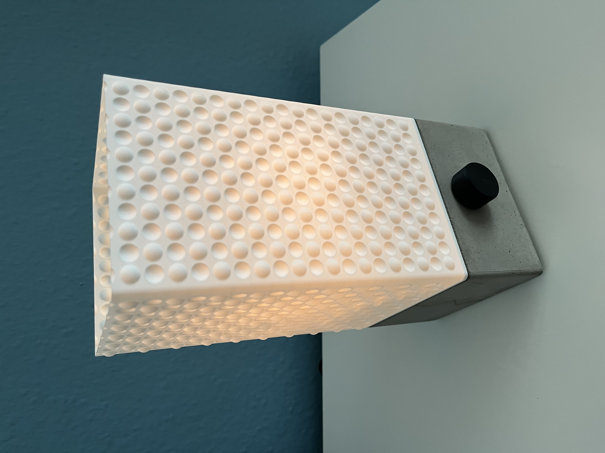

## Contents

- Light controller PCB design
    - [Schematics](light_controller_pcb/light_controller_base/schematics.pdf)
    - [PCB design](light_controller_pcp/light_controller_base/pcb.pdf)
    - KiCad project
    - JLCPCB production files
- CAD designs (FreeCAD projects)
    - concrete lamp base mould
    - shade, light mount and knob

## 1. PCB design

The objective was to develop a controller for various light sources that is powered via USB Power Delivery. The circuit board should be configurable using jumpers. The circuit board should be configurable using jumpers. 

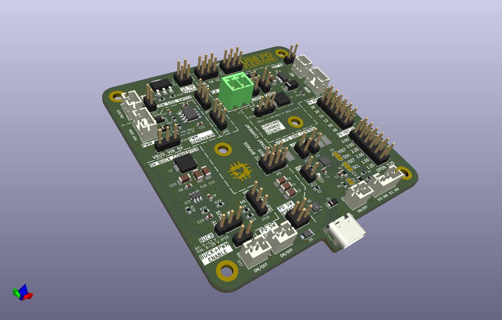

### Features
- Configure output voltage and current 
    - Voltage: 5 V, 9 V, 12 V, 15 V, 20 V, 28 V
    - Current: 1.25 A - 3.25 A
    - Low power LED up to high power halogen lamps (35 W) supported
- Step-down converter to supply control units with all voltage levels
- Dimm light with PWM (555 Timer module)
- Constant current source to fine tune current 
- High power mosfet to switch light 
- 80 x 80 mm

#### USB PD ERP Sink controller ([HUSB238A](https://www.lcsc.com/datasheet/C24833806.pdf)):

- Fully Autonomous USB Type-C® and USB PD Sink Controller
- USB PD Specification Reversion 3.1 supported
- Integrated VBUS Switch Driver
- Error detection output (LED)

#### PWM Controller ([LMC555](https://www.lcsc.com/datasheet/C90760.pdf))

- CMOS variant of famous 555 general-purpose timer
- Duty cycle configurable by 100k potentiometer 

#### Constant Current Source ([PAM2861](https://www.lcsc.com/datasheet/C150496.pdf))

- 1 A LED driber with internal switch
- Adjustable output current (100k potentiometer)

#### Step-Down Converter ([TPS54302](https://www.ti.com/lit/ds/symlink/tps54302.pdf))

- Converts variable VUSB voltage to 5 V to supply 555 timer and constant current control

## 2. Concrete Lamp Base

The lamp's base was made of concrete. To do this, a mold was designed and printed using a 3D printer with PLA. The controller board is installed inside the lamp's base.

### Mould

The mold is designed so that it can be taken apart into separate pieces after curing.

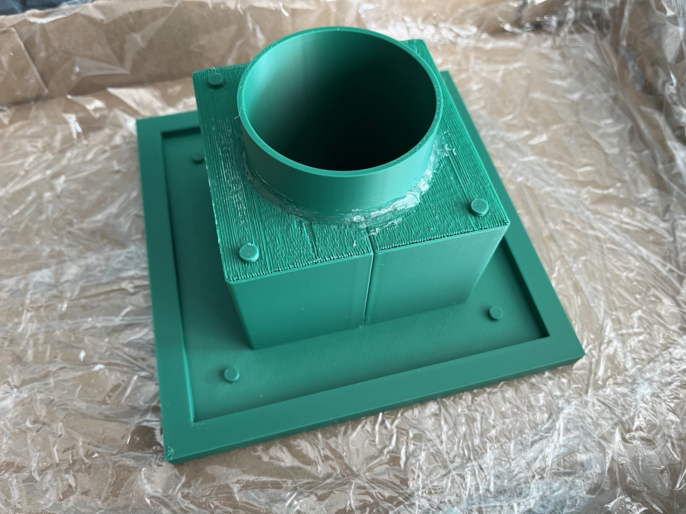

The seams are sealed with hot glue.

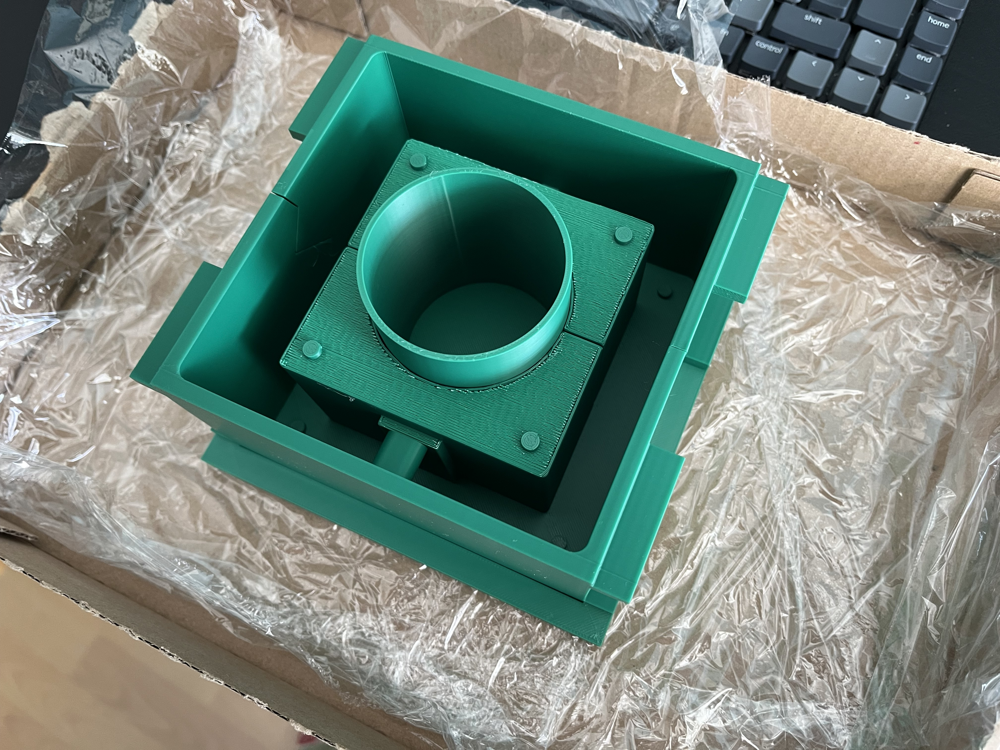

The liquid concrete is poured into the mold up to the top edge:

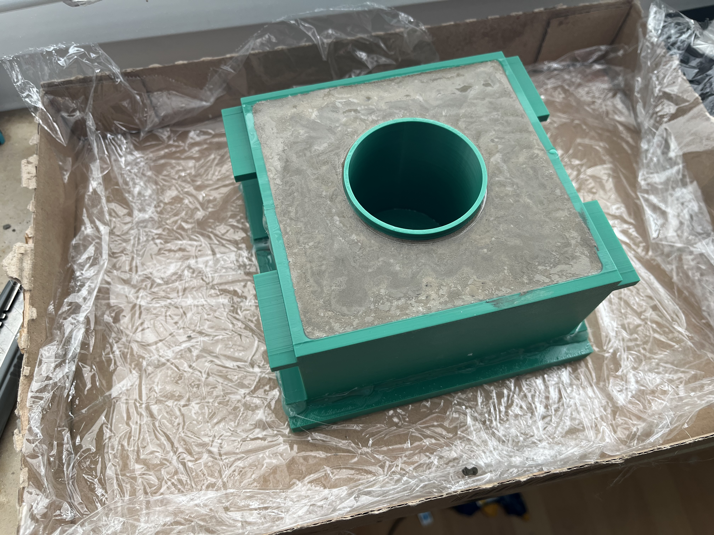

### Box of Shame
To be honest, it took three attempts with different modifications to the base design before I was able to get the concrete piece out of the mold in one piece...

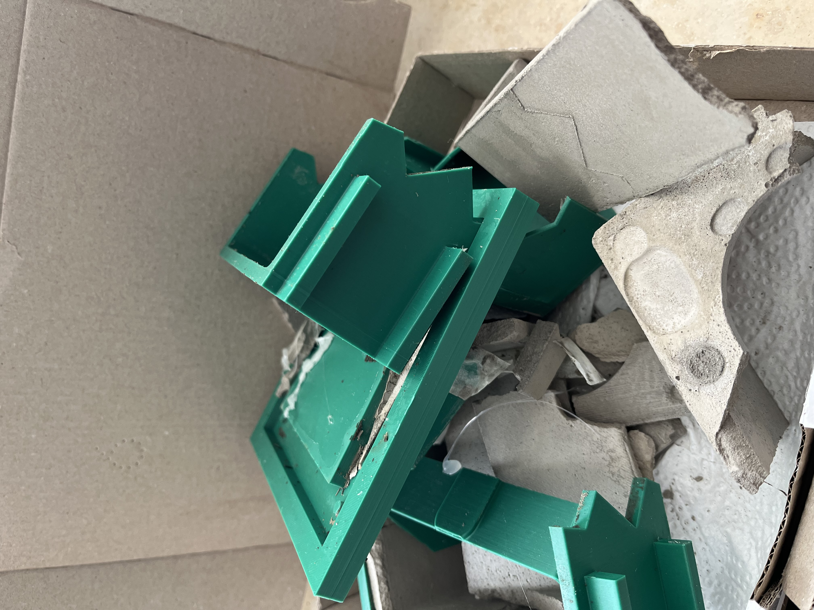

### Base installations

To position the light source in the right spot, a 3D-printed bracket is screwed onto the circuit board: 

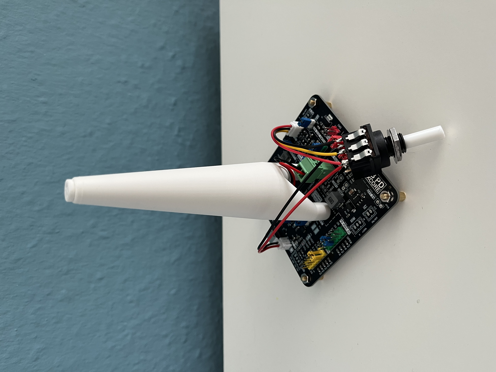

PCB, potentiomenter, knob and magnets are installed to the base:

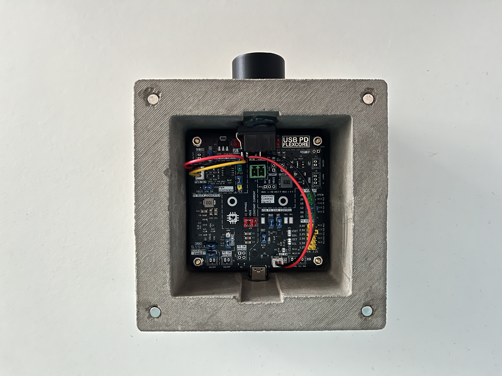

Backside: 

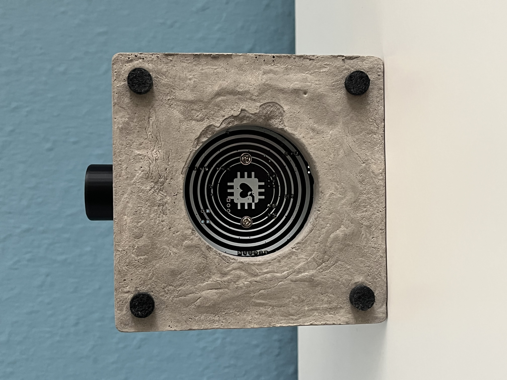

## 3. Shade

The lamp base was designed so that the light shade can be attached using magnets. This means the shade can be easily swapped out. This shade was designed so that it can be 3D-printed in vase mode.

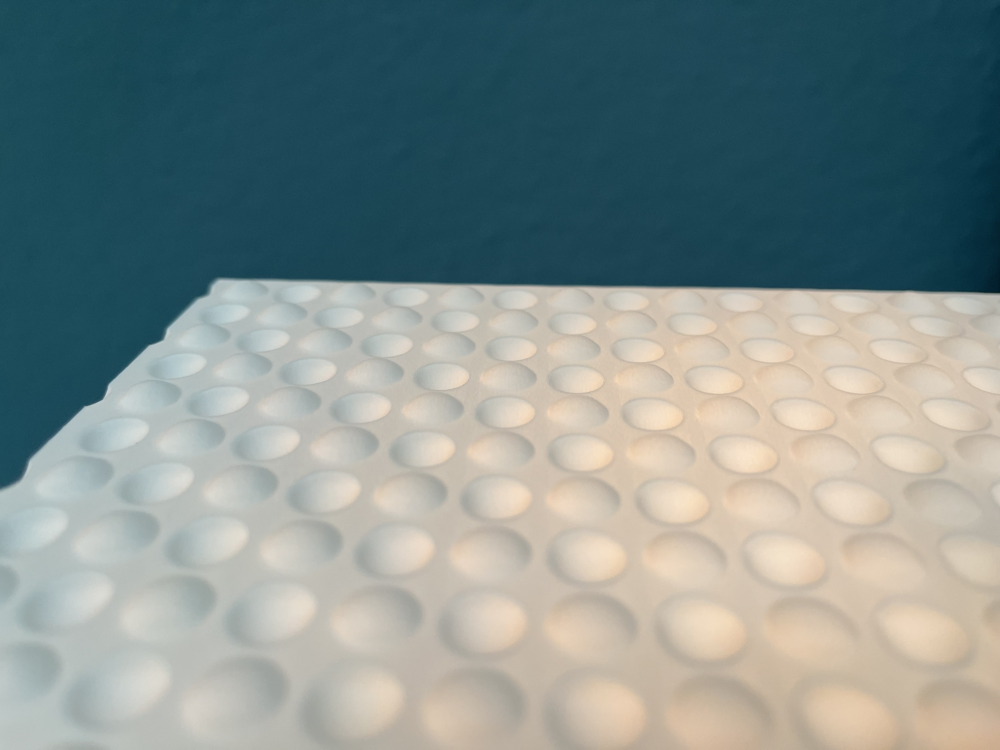
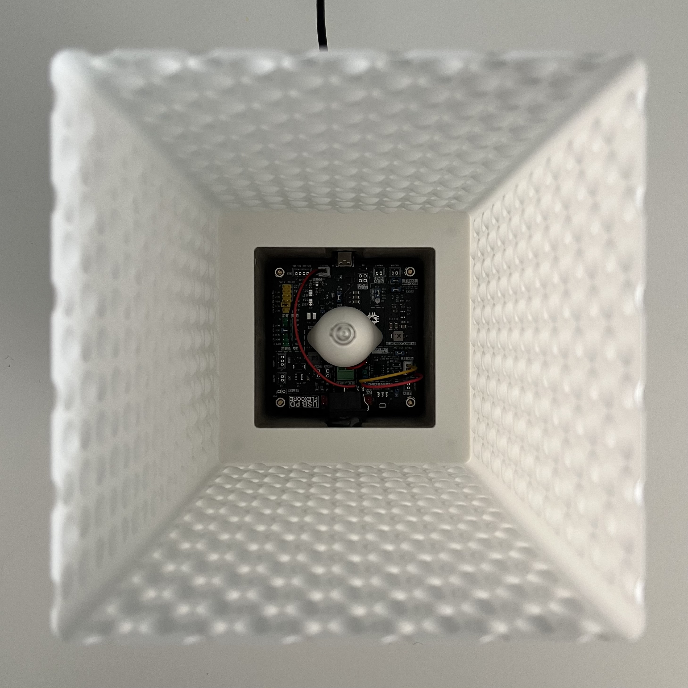

## 4. Light it up!

